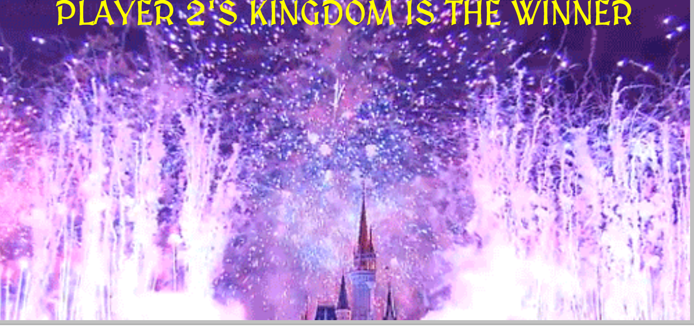

# Aur-Cheesi





## What is Aur-Cheesi?
###Is my own version of the game parcheesi, which is a game that consist in a board ,two dice, four pieces per player that they have to move around the board. In this game the players are kingdoms trying to conquer another kingdom sending their warriors.

###I choose it , cause it's a game that I really enjoyed playing when I was a child, it brings back good memories


##How to Play Aur-Cheesi
* The first player is selected through a random, after that players go in order.
* The players roll two dice and as many point they get, they move a selected warrior.
* The player who gets the same number in both dices, gets an extra turn.
* The players have a different staring point, and a different ending point in the board.
    In the staring point each one has a troll protecting the entrance if a warrior from 
    other kingdom step into the troll, he is send back to his kingdom.
* The are random bombs in the way to the kingdom to be conquer to protect it from invaders, so if any warrior step into a bomb he will be send back to his kingdom.
*If the current player's warrior spet into a position where there are other players, those players are send back to their kingdoms.
* The winner of the game is the first player that moves all his warriors to the kingdom to be conquer.


## Technical Discussion

###For my game I used

*HTML      (Basic board)
*CSS       (Styling and animation) 
*JavaScript(Main functionality(complemented with JQ)  
*JQuery    (Create the board and DOM manipulation)

### Notes on Game Structure

####Code samples
####This part of the code is the part that check is the player can move the piece that he selected
```javascript
function checkMovement($element){
    let myPlayer= $element.data('player');
    let currentPiece= $element.data('piece');

    // verifying the player only moves their own pieces
    if (myPlayer!=arrayGameInfo[currentPlayer].playerId){
        alert(`The kingdoms are only allowed to move their own warriors. \nThis is not your  warrior`);
        return;
    }

    if (dicePoints==0){
        alert("You must roll the dices first");
        return;
    }

    movePieces(dicePoints,$element);
}
```
###Challenges
####My biggest challenge  was the images. I had a hard time and wasted a lot of time finding images. Those that i found were not labeled for reuse, so It was really hard. I wasted hours and  hours and hours on it. I have to find better resources for that.
Another thing is setting priorities, most the of the time I was spending to much time in things that werent as important as others.

## The Making of Aur-cheesi
###Making this game was amazing , the ideas came one after another, and at some point I had so many thing in my head that I was overwhelmed. But I will have the time to put those ideas in the game later.


## Opportunities for Future Growth
###From now and on I would set priorities


##If you had more time to work on your game, what would you do?
###While I Was working on my project I had so many ideas, that couldn't focus on one thing at a time. So I decided to make a list of the things that I would do in the refactoring phase to make my game better.
###Here they are:
* Make the game 3d
* Use better images and sounds.
* Be played from remote computers.
* Add more characters and features
